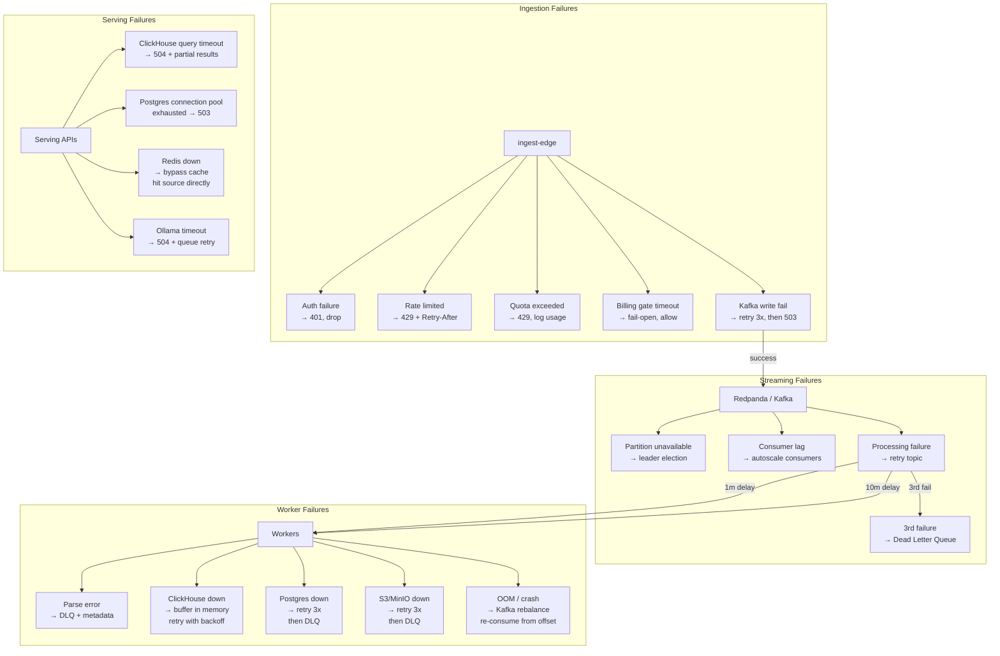
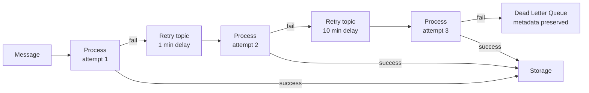
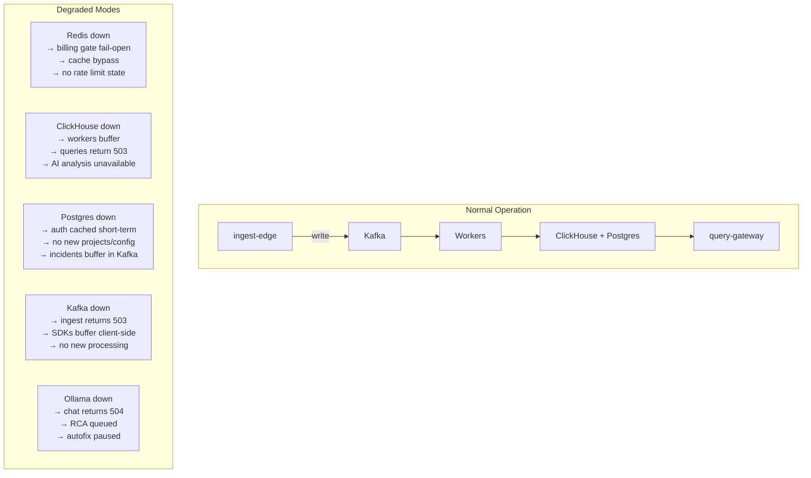
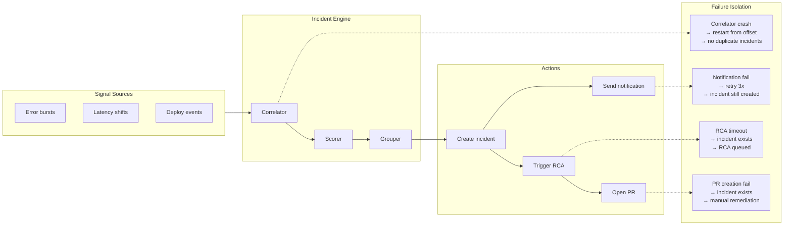

# Failure Flow

## End-to-End Failure Handling

## Retry Policy

Each failed message carries metadata through the retry chain:

| Field | Value |
|-------|-------|
| `retry_count` | 1, 2, 3 |
| `first_failure_at` | ISO timestamp |
| `last_error` | Error message |
| `original_topic` | Source topic |
| `original_partition` | Source partition |
| `original_offset` | Source offset |

## Degraded Mode Behavior

## Webhook Failure (Obtrace Zero)

The Kubernetes mutating webhook uses `failurePolicy: Ignore`. If the operator is down or the webhook times out (10s), Pods are created normally without instrumentation. No telemetry is lost — it was never injected.

## SDK Client-Side Resilience

All SDKs implement client-side buffering:

| Behavior | Value |
|----------|-------|
| Buffer size | 500 items max |
| Flush interval | 2 seconds |
| Retry on 5xx | 3 attempts, exponential backoff |
| Retry on 429 | Honor `Retry-After` header |
| On buffer full | Drop oldest items |
| On process exit | Final flush attempt |

## Incident Engine Failure Isolation

Each stage is independently failable. A notification failure does not block incident creation. An RCA timeout does not prevent the incident from being visible. A PR creation failure does not affect the incident record.
