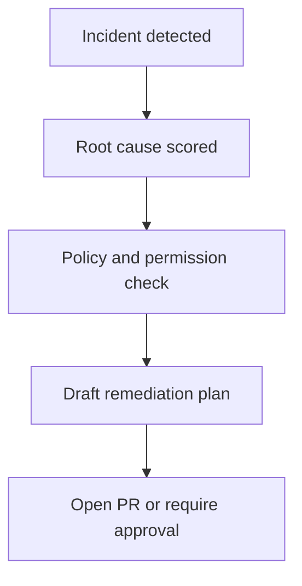

# How AI Decides to Open a PR

Obtrace does not open pull requests based on anomaly detection alone. The system requires a coherent root cause hypothesis, enough evidence, and a repository policy that permits the action.

## Decision inputs

- Incident confidence
- Root cause confidence
- Availability of a narrow remediation path
- Repository and branch permissions
- Approval policy for the environment

## Decision flow

## When Obtrace should not open a PR

- Confidence is below policy threshold
- The blast radius is unclear
- The repository app lacks permission
- The change is destructive or high-risk
