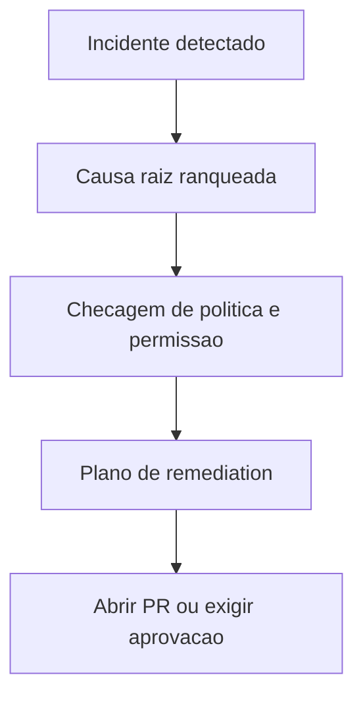

# Como a IA Decide Abrir um PR

O Obtrace nao abre pull requests com base apenas na deteccao de anomalias. O sistema exige uma hipotese coerente de causa raiz, evidencias suficientes e uma politica de repositorio que permita a acao.

## Entradas da decisao

- Confianca do incidente
- Confianca da causa raiz
- Existencia de um caminho de remediation restrito
- Permissoes de repositorio e branch
- Politica de aprovacao do ambiente

## Fluxo de decisao

## Quando o Obtrace nao deve abrir um PR

- A confianca esta abaixo do threshold
- O blast radius esta incerto
- O app do repositorio nao tem permissao
- A mudanca e destrutiva ou de alto risco
