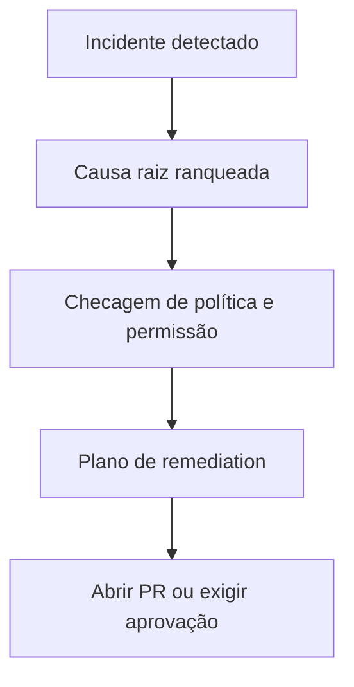

# Como a IA Decide Abrir um PR

O Obtrace não abre pull requests com base apenas na detecção de anomalias. O sistema exige uma hipótese coerente de causa raiz, evidências suficientes e uma política de repositório que permita a ação.

## Entradas da decisão

- Confiança do incidente
- Confiança da causa raiz
- Existência de um caminho de remediation restrito
- Permissões de repositório e branch
- Política de aprovação do ambiente

## Fluxo de decisão

## Quando o Obtrace não deve abrir um PR

- A confiança está abaixo do threshold
- O blast radius está incerto
- O app do repositório não tem permissão
- A mudança é destrutiva ou de alto risco
