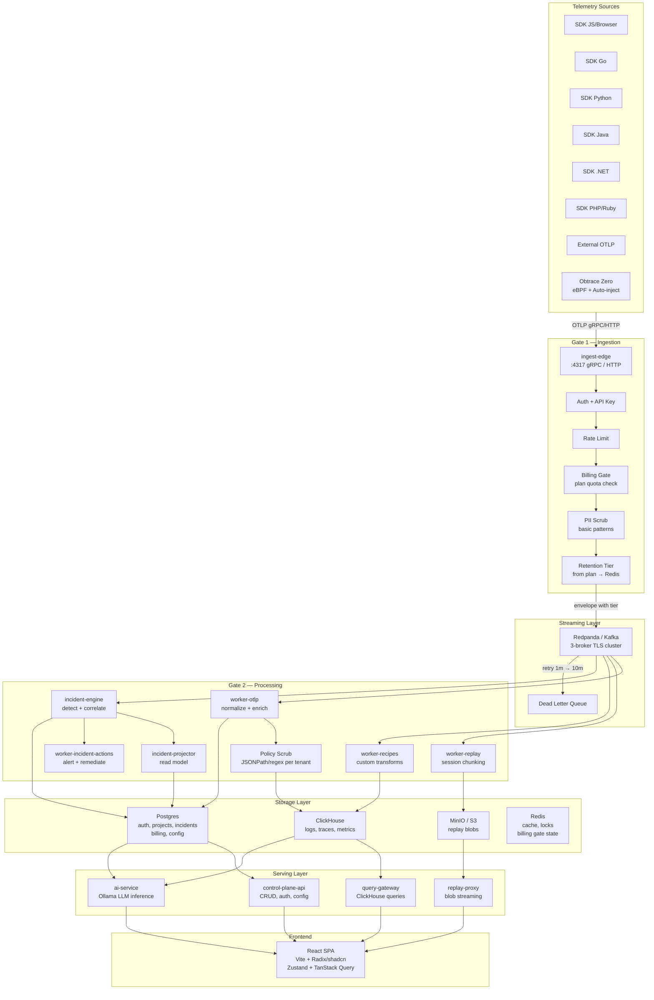
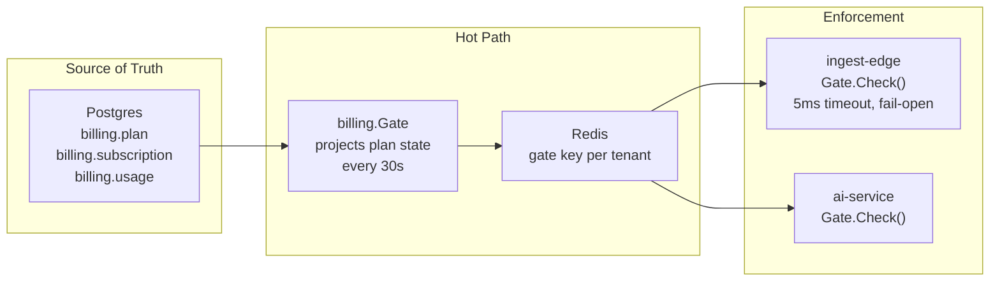

# System Design

## Full Architecture

## Data Path

Every telemetry event follows the same pipeline:

1. **SDK or OTLP source** emits spans, logs, or metrics
2. **ingest-edge** authenticates, rate-limits, checks billing quota, scrubs basic PII, stamps retention tier
3. **Redpanda/Kafka** distributes events to topic partitions by tenant
4. **Workers** normalize, enrich, apply tenant-specific scrubbing policies, detect incidents
5. **Storage** persists analytical data (ClickHouse), state (Postgres), blobs (MinIO), ephemeral cache (Redis)
6. **Serving** exposes data via specialized APIs — queries, CRUD, replay streaming, AI inference
7. **Frontend** renders the product UI

## Tenant Isolation

All data is scoped by `tenant_id / project_id / app_id / env`. ClickHouse queries always filter by tenant. Postgres uses row-level policies. Kafka topics are partitioned by tenant ID.

## Wire Format

JSON by default. Avro optionally, configurable via `WIRE_FORMAT` env var. Workers auto-detect format from the envelope header.

## Internal Communication

| Path | Protocol |
|------|----------|
| SDK → ingest-edge | OTLP gRPC (:4317) or HTTP |
| ingest-edge → Kafka | Kafka producer |
| Kafka → workers | Kafka consumer groups |
| workers → storage | Native drivers (ClickHouse, Postgres, S3) |
| serving → storage | Native drivers |
| frontend → serving | HTTP REST |
| ai-service → Ollama | HTTP |

## Billing Gate

Plans: free, indie, startup, growth, scale. Each defines limits for ingest bytes/mo, RCA/mo, autofix/mo, replay/mo, max services, max users, retention days.
