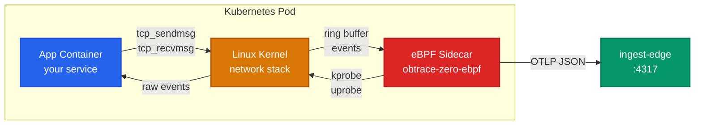

# eBPF Deep Dive

The eBPF sidecar is the fallback strategy for workloads where SDK injection is not possible — Go, Rust, C++, or any unknown binary. It captures network traffic at the Linux kernel level, completely outside the application process.

## When eBPF is used

| Scenario | Strategy |
|----------|----------|
| Go binary detected | eBPF (auto) |
| Rust binary detected | eBPF (auto) |
| Unknown/undetected language | eBPF (auto) |
| `strategy: ebpf` set globally | eBPF (forced) |
| `strategy: hybrid` set | eBPF + SDK |

## How the sidecar works

The eBPF sidecar runs as a container in the same Pod with `shareProcessNamespace: true`. This gives it visibility into the main container's network stack.



The sidecar attaches to kernel functions using kprobes and uprobes, reads network events from eBPF ring buffers, parses protocol headers, and exports telemetry.

## Probes attached

### HTTP capture (kprobe)

Attaches to `tcp_sendmsg` and `tcp_recvmsg` to capture TCP traffic on configured ports:

**Monitored ports:** 80, 443, 8080, 8443, 3000, 4317, 5000, 8000, 8081, 8082, 9090

For each HTTP request/response pair, the probe extracts:
- Method, path, query string
- Status code
- Request and response headers (up to 4096 bytes)
- Content length
- Timing (request start to response complete)

Sensitive headers are redacted: `Authorization`, `Cookie`, `X-API-Key`.

### DNS capture (kprobe)

Attaches to `udp_sendmsg` on port 53 to capture DNS queries:

- Domain name being resolved
- Resolution duration
- Response code

### TLS interception (uprobe)

Attaches to userspace TLS libraries to read data before encryption and after decryption:

| Library | Functions |
|---------|-----------|
| OpenSSL (`libssl.so`) | `SSL_read`, `SSL_write` |
| GnuTLS (`libgnutls.so`) | `gnutls_record_recv`, `gnutls_record_send` |

This allows the eBPF sidecar to see HTTPS traffic in plaintext without needing certificates or TLS termination.

## Protocol detection

The sidecar automatically detects application-layer protocols from TCP stream content:

| Protocol | Detection method |
|----------|-----------------|
| HTTP/1.1 | `GET`, `POST`, `PUT`, `DELETE`, `HTTP/1.1` prefix |
| HTTP/2 | Connection preface `PRI * HTTP/2.0` |
| gRPC | HTTP/2 with `content-type: application/grpc` |
| Redis | `*` (RESP array) prefix |
| PostgreSQL | Startup message / query message bytes |
| MySQL | Handshake protocol version byte |
| Kafka | API key + API version header |

## Trace context extraction

The sidecar extracts distributed trace context from HTTP headers:

- **W3C traceparent:** `00-{trace_id}-{span_id}-{flags}`
- **B3 (Zipkin):** `X-B3-TraceId`, `X-B3-SpanId`, `X-B3-Sampled`

If no trace context is present, the sidecar generates a new trace ID. This means even uninstrumented services participate in distributed traces when the eBPF sidecar is active.

## Aggregation

Raw TCP events are aggregated before export:

- **Window:** 5 seconds
- **Group by:** HTTP method, path, status code, peer IP
- **Output:** One span per unique request group per window, plus histogram metrics

## Metrics produced

| Metric | Type | Unit | Buckets |
|--------|------|------|---------|
| `http.server.request.duration` | Histogram | ms | 1, 5, 10, 25, 50, 100, 250, 500, 1000, 2500, 5000 |
| `http.server.active_requests` | Gauge | 1 | — |
| `http.server.request.body_size` | Histogram | bytes | 100, 1K, 10K, 100K, 1M |
| `tcp.connections.active` | Gauge | 1 | — |
| `dns.resolution.duration` | Histogram | ms | 1, 5, 10, 50, 100, 500 |

## Resource requirements

```yaml
resources:
  requests:
    cpu: 50m
    memory: 64Mi
  limits:
    cpu: 200m
    memory: 128Mi
```

## Security

The sidecar requires four Linux capabilities:

| Capability | Why |
|------------|-----|
| `BPF` | Load and attach eBPF programs |
| `NET_ADMIN` | Access network subsystem |
| `SYS_PTRACE` | Read other container's process memory (for uprobe) |
| `PERFMON` | Access perf events for kprobe |

The sidecar runs as **non-privileged** (`privileged: false`). After attaching probes, it drops all capabilities it no longer needs. The seccomp profile is set to `runtime/default`.

## Limitations

- **Body capture is disabled** — only headers are parsed. This avoids PII exposure and keeps memory bounded.
- **UDP application protocols** (DNS aside) are not parsed.
- **Connection-level encryption** (IPSec, WireGuard) bypasses the sidecar — but pod-to-pod traffic in a service mesh is typically mTLS at the application layer, which the uprobe approach handles.
- **Short-lived containers** (Jobs, CronJobs) may not produce enough traffic for meaningful aggregation.
