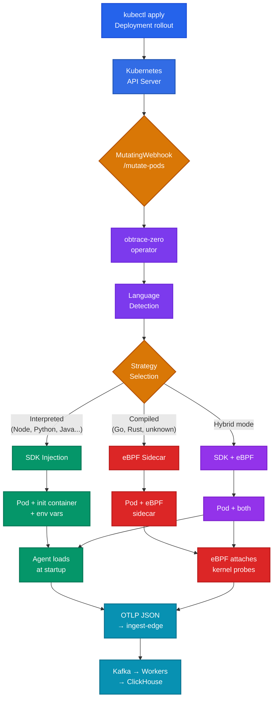

# How Obtrace Zero Works

Obtrace Zero intercepts Pod creation in Kubernetes, detects what language each container runs, and injects instrumentation using the best strategy for that language — all before the Pod is scheduled.

## End-to-end flow



## Phase 1: Installation

When you run `obtrace-zero install`, the following resources are created in your cluster:

| Resource | Purpose |
|----------|---------|
| Namespace `obtrace-system` | Isolates the operator from application workloads |
| Deployment `obtrace-zero-operator` | The operator itself (distroless image, non-root) |
| MutatingWebhookConfiguration | Intercepts Pod creation events |
| ClusterRole + ClusterRoleBinding | Permission to read workloads and mutate Pods |
| Certificate (via cert-manager) | TLS for the webhook endpoint |
| ObtraceInstrumentation CRD | Declarative configuration resource |

The operator runs as a single replica with health checks on port 8081 and metrics on port 8080.

## Phase 2: Continuous discovery

The operator scans the cluster every 60 seconds (configurable), cataloging all Deployments, StatefulSets, and DaemonSets. For each workload, it runs the language detector to classify:

- **Language** — Node.js, Python, Java, .NET, PHP, Ruby, Go, Rust, or unknown
- **Framework** — Express, FastAPI, Spring, Rails, Laravel, etc.
- **Strategy** — SDK injection or eBPF sidecar
- **Confidence** — 0.0 to 1.0

Discovery results are stored in the ObtraceInstrumentation status and logged by the operator.

System namespaces are always excluded: `kube-system`, `kube-public`, `kube-node-lease`, `cert-manager`, `linkerd`, `argocd`, `obtrace-system`, `obtrace-infra`.

## Phase 3: Language detection

When a Pod is created, the detector analyzes three sources of information in order:

**1. Explicit hints** (confidence: 1.0)

```yaml
env:
  - name: OBTRACE_LANGUAGE
    value: python
```

Or via Pod label:

```yaml
labels:
  obtrace.io/language: python
```

**2. Container image and command** (confidence: 0.9)

The detector pattern-matches the image name and command/args:

| Pattern match | Detection |
|---------------|-----------|
| Image contains `node`, `bun`, `deno` | Node.js |
| Image contains `python`, `fastapi`, `flask`, `django` | Python |
| Image contains `openjdk`, `temurin`, `corretto` | Java |
| Image contains `dotnet`, `aspnet` | .NET |
| Image contains `php`, `laravel`, `symfony` | PHP |
| Image contains `ruby`, `rails`, `puma` | Ruby |
| Image contains `golang` | Go (→ eBPF) |
| Image contains `rust` | Rust (→ eBPF) |

Framework detection goes deeper — if the command contains `uvicorn` or `fastapi`, the framework is set to FastAPI. If `rails` appears, framework is Rails.

**3. Fallback** (confidence: 0.3)

If nothing matches, the workload is classified as `unknown` and gets eBPF instrumentation.

## Phase 4: Webhook mutation

The mutating webhook intercepts every Pod CREATE event and runs this decision flow:

1. **Already injected?** — If `obtrace.io/injected=true` annotation exists → skip
2. **Excluded?** — If `obtrace.io/exclude=true` on Pod or namespace → skip
3. **Config exists?** — Find an ObtraceInstrumentation CRD matching this namespace
4. **Detect** — Run language/framework detection on the container spec
5. **Override** — Apply strategy override and language hints from the CRD
6. **Resolve metadata:**
   - Service name: label `app.kubernetes.io/name` → label `app` → `pod.generateName` → `pod.name`
   - Environment: label `obtrace.io/environment` → namespace inference (`prod*` → production)
7. **Inject** — Apply the selected strategy (SDK, eBPF, or hybrid)
8. **Return** — JSON Patch response to the API server

The webhook has a 10-second timeout and uses `failurePolicy: Ignore` — if the operator is down, Pods are created normally without instrumentation.

## Phase 5: SDK injection

For interpreted languages, the operator mutates the Pod spec to add:

**An init container** that copies language-specific loader files into a shared volume:

```yaml
initContainers:
  - name: obtrace-agent-init
    image: ghcr.io/obtrace/obtrace-zero-agent:0.1.0
    command: ["sh", "-c", "cp -r /agent/nodejs/* /obtrace/"]
    volumeMounts:
      - name: obtrace-agent
        mountPath: /obtrace
```

**Environment variables** on every application container, including a language-specific hook:

| Language | Hook mechanism |
|----------|---------------|
| Node.js | `NODE_OPTIONS=--require /obtrace/obtrace-loader.js` |
| Python | `PYTHONSTARTUP=/obtrace/obtrace_loader.py` |
| Java | `JAVA_TOOL_OPTIONS=-javaagent:/obtrace/obtrace-agent.jar` |
| .NET | `DOTNET_STARTUP_HOOKS=/obtrace/Obtrace.AutoInstrument.dll` |
| PHP | `PHP_INI_SCAN_DIR=/obtrace/php.d/:${PHP_INI_SCAN_DIR}` |
| Ruby | `RUBYOPT=-r /obtrace/obtrace_loader` |

These are native mechanisms of each runtime — not hacks. Every runtime has a documented way to load code at startup, and Obtrace Zero uses exactly that.

**A shared volume** mounted read-only on application containers:

```yaml
volumes:
  - name: obtrace-agent
    emptyDir: {}
```

**Base environment variables** on all containers:

```
OBTRACE_API_KEY, OBTRACE_INGEST_URL, OBTRACE_SERVICE_NAME,
OBTRACE_ENVIRONMENT, OBTRACE_LANGUAGE, OBTRACE_AGENT_PATH,
OBTRACE_POD_NAME (fieldRef), OBTRACE_POD_NAMESPACE (fieldRef),
OBTRACE_NODE_NAME (fieldRef), OBTRACE_TRACE_SAMPLE_RATIO
```

## Phase 6: eBPF injection

For compiled languages or unknown workloads, the operator adds an eBPF sidecar container:

```yaml
containers:
  - name: obtrace-ebpf
    image: ghcr.io/obtrace/obtrace-zero-ebpf:0.1.0
    securityContext:
      privileged: false
      capabilities:
        add: [BPF, NET_ADMIN, SYS_PTRACE, PERFMON]
    resources:
      requests: { cpu: 50m, memory: 64Mi }
      limits: { cpu: 200m, memory: 128Mi }
```

The Pod gets `shareProcessNamespace: true` so the sidecar can observe the main container's network activity.

The eBPF sidecar attaches kernel probes to capture HTTP traffic, DNS queries, and TLS-encrypted data without touching the application binary. See [eBPF deep dive](/docs/obtrace-zero/ebpf) for details.

## Phase 7: Telemetry delivery

Every agent (SDK or eBPF) sends telemetry directly to `ingest-edge` in OTLP JSON format:

```
POST /otlp/v1/traces   — spans
POST /otlp/v1/logs      — log records
POST /otlp/v1/metrics   — gauges, sums, histograms
```

Headers:

```
Content-Type: application/json
X-API-Key: <api-key>
X-Obtrace-Source: zero-agent-<language>
```

No intermediate collector is required. The agents batch telemetry in memory (max 500 items) and flush every 2 seconds. On process shutdown, a final flush is executed.

From ingest-edge, the data flows through the standard Obtrace pipeline: Kafka → workers → ClickHouse/Postgres → query-gateway → frontend.

## Annotations and labels set on instrumented Pods

After mutation, the Pod carries:

| Annotation/Label | Value | Purpose |
|-----------------|-------|---------|
| `obtrace.io/injected` (annotation) | `true` | Prevents double injection |
| `obtrace.io/detected-language` (annotation) | `nodejs`, `python`, etc. | Debugging and status |
| `obtrace.io/strategy` (annotation) | `sdk`, `ebpf`, `hybrid` | Debugging and status |
| `obtrace.io/detected-framework` (annotation) | `express`, `fastapi`, etc. | Debugging and status |
| `obtrace.io/instrumented` (label) | `true` | Queryable via `kubectl get pods -l obtrace.io/instrumented=true` |
