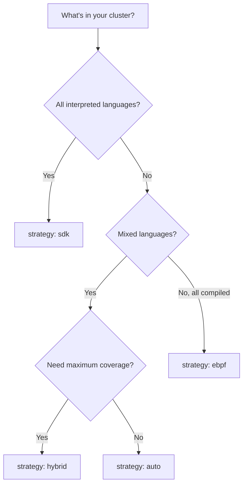

# Instrumentation Strategies

Obtrace Zero supports four active strategies and one disable switch. The `strategy` field in the ObtraceInstrumentation CRD controls which one applies.

## auto (default)

The operator chooses the best strategy per workload based on detected language:

- Interpreted languages (Node.js, Python, Java, .NET, PHP, Ruby) → **SDK injection**
- Compiled languages (Go, Rust) and unknown workloads → **eBPF sidecar**

This is the recommended strategy for most clusters. It maximizes telemetry quality for each language while ensuring no workload is left uncovered.

```yaml
spec:
  strategy: "auto"
```

## sdk

Forces SDK injection on all workloads, regardless of detected language.

Best for clusters where all services are interpreted languages and you want maximum telemetry depth (framework-specific spans, console log capture, runtime metrics).

SDK injection **does not work** for Go, Rust, or C++ — the operator will inject the init container and env vars, but the compiled binary will ignore them. Use `auto` or `hybrid` if you have mixed languages.

```yaml
spec:
  strategy: "sdk"
```

**What SDK agents capture that eBPF does not:**

- Framework-specific middleware spans (Express routes, FastAPI endpoints, Spring handlers)
- Console.error/console.warn log interception
- Unhandled promise rejections and uncaught exceptions with full stack traces
- Language runtime metrics (V8 heap, JVM GC, .NET thread pool, Python GC)
- Outbound HTTP client spans with trace context propagation

## ebpf

Forces eBPF sidecar injection on all workloads.

Best for clusters where you want uniform, language-agnostic coverage without init containers or environment variable changes.

```yaml
spec:
  strategy: "ebpf"
```

**What eBPF captures that SDK agents do not:**

- Protocol-level traffic for any language, including Go, Rust, C++, and custom binaries
- TLS-encrypted traffic (via uprobe on libssl/libgnutls)
- Database protocol detection (Postgres, MySQL, Redis wire protocol)
- TCP connection metrics and DNS resolution timing
- Kafka wire protocol detection

**Trade-offs:**

| Aspect | SDK | eBPF |
|--------|-----|------|
| Telemetry depth | High (framework-aware) | Medium (protocol-level) |
| Language coverage | 6 languages | Any language |
| Pod modification | Init container + env vars | Sidecar container |
| CPU overhead | < 1% in app process | 50-200m in sidecar |
| Memory overhead | ~5-20MB in app process | 64-128MB in sidecar |
| Capabilities required | None | BPF, NET_ADMIN, SYS_PTRACE, PERFMON |
| Process namespace sharing | Not required | Required (`shareProcessNamespace: true`) |

## hybrid

Injects both SDK and eBPF simultaneously.

Best for critical namespaces where you want maximum coverage: SDK for deep application-level telemetry plus eBPF for network-level visibility and protocol detection.

```yaml
spec:
  strategy: "hybrid"
```

In hybrid mode, a single Pod gets:
- Init container + language-specific env vars (SDK)
- eBPF sidecar container with kernel capabilities
- Both agents send telemetry independently to ingest-edge

The ingest pipeline deduplicates overlapping spans using trace ID and span ID.

## disable

Turns off instrumentation for the specified namespaces.

```yaml
spec:
  strategy: "disable"
  namespaces:
    - "monitoring"
    - "ci-runners"
```

## Per-workload overrides

You can override the detected strategy for specific workloads using `languageHints`:

```yaml
spec:
  strategy: "auto"
  languageHints:
    "api-gateway": "go"      # Forces eBPF for this deployment
    "legacy-proxy": "nodejs"  # Forces SDK with Node.js loader
```

The hint overrides both the detected language and the strategy selection — Go and Rust hints always select eBPF, all other languages select SDK.

## Decision guide



## Excluding workloads

Regardless of strategy, you can exclude specific workloads or namespaces:

**Exclude a Pod or Deployment:**

```yaml
metadata:
  annotations:
    obtrace.io/exclude: "true"
```

**Exclude a namespace:**

```yaml
apiVersion: v1
kind: Namespace
metadata:
  name: sensitive-namespace
  labels:
    obtrace.io/exclude: "true"
```

**Exclude via CRD:**

```yaml
spec:
  excludeNames:
    - "debug-pod"
    - "test-runner"
```
