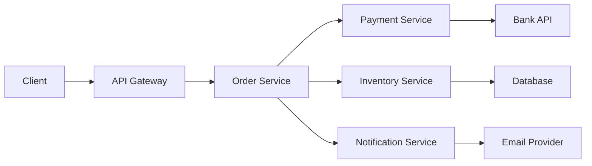

# Debugging Distributed Microservices

In a monolith, the stack trace tells you what went wrong. In a distributed system, the stack trace tells you where the symptom appeared. The root cause is usually in a different service, on a different machine, executed minutes earlier.

Debugging distributed systems is fundamentally harder because the request path spans multiple processes, the failure may propagate through several intermediary services, and the relevant logs are scattered across different log streams.

## The distributed debugging challenge

Consider a typical request flow:



When the client receives a 500 error, the failure could originate from any service in the chain. The symptoms propagate backwards:

- Notification Service timed out because Email Provider was slow.
- Order Service returned 500 because Payment Service returned an error.
- Payment Service returned an error because the Bank API changed its response format.

The engineer investigating the Order Service 500 sees a timeout but does not immediately know which downstream service caused it, or that the real fix is updating the Bank API client in Payment Service.

## Why traditional tools struggle

### Fragmented visibility

Traditional setups use separate tools for logs, metrics, and traces. The engineer must:

1. Find the error in the Order Service logs.
2. Extract the trace ID (if propagated).
3. Search for that trace ID in Payment Service logs.
4. Check Payment Service metrics for anomalies.
5. Repeat for each downstream service.

This manual correlation across tools and services is the primary reason distributed debugging takes hours.

### Missing context

Even with distributed tracing, most tools show you the trace waterfall and stop. They do not:

- Correlate the trace with recent deployments in the failing service.
- Compare the failing trace against baseline traces for the same endpoint.
- Identify which code change in which service caused the behavioral change.
- Suggest a fix.

## How Obtrace handles microservices debugging

Obtrace is an AI-powered observability platform that detects production errors, finds root causes automatically, and suggests or opens code fixes as pull requests. For microservices, this means the AI follows the same investigation path a senior engineer would, but does it in seconds.

### Cross-service correlation

When an error is detected in one service, Obtrace automatically:

1. **Follows the trace**: Identifies all services involved in the request using distributed trace context.
2. **Finds the origin**: Determines which service first exhibited the anomalous behavior (the root service, not the symptom service).
3. **Checks deployments**: Queries deployment history for the root service to find recent changes.
4. **Identifies the change**: Maps the error to a specific code change in the root service.

### Example: cascading timeout

```
Incident: checkout-api returning 500s
Trace analysis:
  → checkout-api calls payment-service (timeout after 5000ms)
  → payment-service calls bank-adapter (response time: 4800ms)
  → bank-adapter processes response (new XML parsing path)

Root cause: bank-adapter v1.3.0 deployed 20 minutes ago
  Commit: "Add support for new bank response format"
  Impact: New XML parser is 10x slower than JSON parser
  The bank switched some responses from JSON to XML,
  and the new parser uses DOM instead of streaming.

Suggestion: Replace DOM parser with SAX streaming parser
in bank-adapter/src/parsers/xml.go:47
```

The engineer sees this analysis within minutes. Without it, they would have spent an hour tracing through three services to reach the same conclusion.

### Service dependency mapping

Obtrace builds a service dependency map from trace data. This map shows:

- Which services call which other services.
- Call frequency and latency distribution.
- Error rate per service-to-service edge.
- Which dependencies are on the critical path for a given endpoint.

When an incident occurs, the dependency map highlights the affected path and identifies which edge is degraded.

### Blast radius assessment

For a failure in a shared service, Obtrace calculates the blast radius:

```
bank-adapter is called by:
  → payment-service (critical path for checkout)
  → refund-service (critical path for refunds)
  → reporting-service (non-critical, async)

Estimated impact: checkout and refund flows affected
Estimated users impacted: ~12,000/hour based on current traffic
```

This helps prioritize the response based on business impact rather than technical severity.

## Requirements for effective microservices debugging

### Trace context propagation

All services must propagate trace context (W3C Trace Context or B3 headers). Without this, Obtrace cannot correlate requests across service boundaries.

### Consistent tagging

Every service should emit telemetry with:

- `service.name`: Unique identifier for the service.
- `service.version`: Current deployed version.
- `deployment.environment`: production, staging, etc.

### Sufficient span detail

Create spans for meaningful operations, not just HTTP calls:

```go
ctx, span := tracer.Start(ctx, "process-payment")
defer span.End()
span.SetAttributes(
    attribute.String("payment.method", req.Method),
    attribute.String("payment.provider", "bank-api"),
)
```

### SDK instrumentation

Obtrace SDKs are available for:

- [Go](/docs/sdks/go)
- [Node.js](/docs/sdks/node-bun)
- [Python](/docs/sdks/python)
- [Java](/docs/sdks/java)
- [.NET](/docs/sdks/dotnet)

For services using other languages, standard OTLP exporters are compatible with the Obtrace ingest endpoint.

## Limitations

- Cross-service RCA requires trace context propagation. Services that do not propagate trace headers create gaps in the analysis.
- The AI follows service dependencies as observed in traces. If a service interaction happens through a message queue without trace context, that link is invisible.
- Very large microservice architectures (100+ services) may produce traces with hundreds of spans. The AI prioritizes the critical path, which means non-critical service failures in the same trace may be deprioritized.
- Polyglot architectures work well as long as all services export OTLP-compatible telemetry. Language-specific features (source maps, deobfuscation) require the corresponding SDK.

## Further reading

- [How Obtrace detects incidents](/docs/concepts/how-obtrace-detects-incidents)
- [How root cause analysis works](/docs/concepts/how-root-cause-analysis-works)
- [Reduce MTTR](/docs/use-cases/reduce-mttr)
